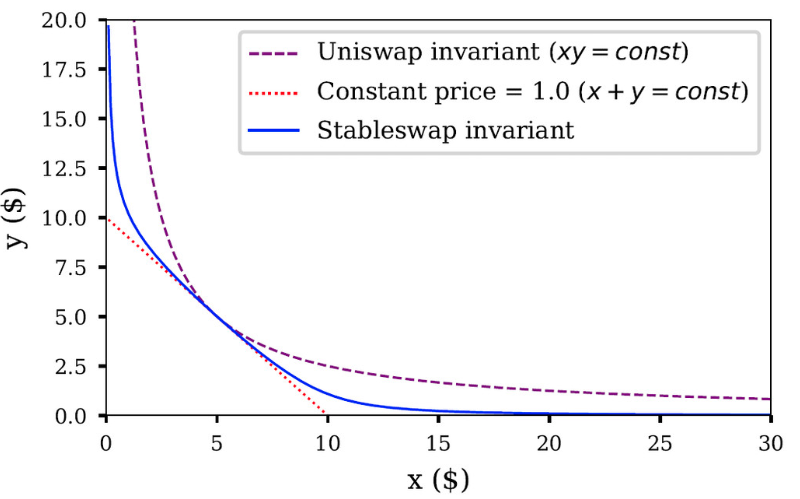

# Flashloans with brownie and pytest #1 - DeFi fundamentals

## Brief explanation of fundamentals
Most of the decentralized exchanges (DEXes) rely on automatic market makers (AMM) which differs from traditional order book existing on centralized exchanges (CEXes). Traditional order book is just batch of sell and buy orders which meet at some point between the hishest sell and lowest buy order. When somebody is able to accept current price in order book the transaction happens. AMM however uses user's liquidity to trading assets and allow users to trade their crypto directly on-chain through smart contracts without giving control of their private keys. Uniswap (first DEX) allowed anyone to be "market maker" by providing liquidity. Liquidity providers get LP-tokens (usually ERC20 tokens) which reflects their share in the pool. So user's can be some kind of cantors by providing liquidity and having some rewards from cantor's clients who exchange tokens. One of the most important feature is fact that the price in AMM concept is not dynamicaly updated like in traditional order book model. It creates the opportunity to arbitrage and what is more, the arbitrage is usually the only thing which keeps the prices of multiple tokens pegged with other exchanges once the liquidity depth is violated. 
## Arbitrages on dexes
In order to buy cheaper token on one dex and sell it on another, you must know the AMM formula and reserves of certain pool. The simplest example is reciprocal function formula applied by Uniswap k = x * y, where k is a constant and x,y may vary as the reserves in pool changes due to swaps.

.png "Reciprocal function")

When the change happens, there is need to find another exhange where the reserves keeps the previous ratio. There is a wide range of dexes to choose.  

## New innovations introduced by Sushiswap, Curve and Balancer
The Uniswap AMM idea has been improving by different protocols. Each protocol introduces a new innovations related to AMMs. 

### Sushiswap
The first one is Sushiswap that was created basing on uniswap idea. The main innovation here was the dex token can be farmed by liquidity providers. Later the Sushiswap has choosen a little different way than Uniswap introducing lending and borrowing solutions and trying to be on every important EVM blockchain. 
### Curve
Another dex is a Curve which improved swapping between stablecoins by flattening the uniswap hyperbola curve (x*y=k) in the area where the most swaps happens.

Moreover the curve has a little different approach to pools architecture and is written in different technologies than other dexes (mainly Python and Vyper instead of Javascript and Solidity). The Curve is also more transparent and offers very interesting governance functionality for farming their token CRV.

### Balancer
The last but not least protocol is a Balancer that as the first protocol allowed to provide more than 2 tokens (up to 8) into the liquidity. The price in such pool is determined by pool balances, pool weights and amounts of tokens what is called weighted math. Moreover there was introduced something called portfolio manager and crypto index funds what allows to create synthetic index fund of certain tokens which automaticly rebalance itsefl as needed. Another features are Liquidity Bootstrapping Pools (LBP) and vault. LBP give an opportunity to rebalance of certain assets of the newly created pool from LBP. LBP usually has highly trusted coin with small proportion and is used to rebalance a new pool. The vault is a kind of mapping of pools and its balances, so it keeps all pool's balances provide interfaces for interactions and informations. Such approach allows to reduce gas spending on certain swaps and especially when routing (swaps between multiple pools in order to get expected token which is not directly available in on swap) comes into place. The next improvement which goes with the vault is that the rebalancing can happen inside vault smart contract without external interaction between a pool so there is less gas usage.

## Summary: dexes pros and cons
Dexes advantages:
- User control the funds
- Anonymous
- No central entity which could be hacked
- Routing
- Transparency

Drawbacks:
- Not easy to use,
- Usually lower liquidity,
- Vulnerability of smart contracts

## What is Aave and how flashloan works ?
Aave is a lending and borrowing protocol. As the name shows protocol allows to lend some crypto and get a certain interest rate from it. On the other side there are borrowers who can borrow some crypto and pay some certain interests to maintain position. Unfortunately currently there is no stable protocol which allows to borrow crypto without callateral deposit. So in order to borrow it is required to provide some kind of valuable collateral like other cryptocurrnecy. Because of that borrowing is used mainly to laverage current positions or shorting certain assets. The main protocols which allows for desribed techniques are Compound and Aave. But aave came up with something even more crazy. They created special smart contract which utilizes provided lending liquidity to giving cryptocurrency without any collaterals! There are of course bunch of constraints which prevents from borrowing crypto and not paying it off. The most significant constraint is the requirement to repay borrowed crypto with some interests in the same transaction. Such approach make all necessary checks related to not paying funds off possible. Flashloans are usually used for arbitrages and all transacions related to them are performed in the same block.

# Flashloans with brownie and pytest #2 - Toolset overview and Api building

## Brief introduction to Brownie
## How pytest works and what are the fixtures ?

## Brownie config

## Api scheme
The reason for writing api class is to standarize interfaces along dexes. Despite of many differences, the main functionalities remain the same: swap, get price determined by pool and add/remove liquidity. All this three functionalities must be encapusalted from Dex's interfaces into the class api.
## RouterV2_Api class

## Curve_Api class

## Balancer_Api class

# Flashloans with brownie and pytest #3 - Arbitrage tests and flashloan implementation

## Arbitrage class

## Integration classes with arbitrage

## Conftest preparation
## Tests

## Pytest CLI (debugging)

## Flashloan Smart Contract

## Final Tests

# Flashloans with brownie and pytest #4 - Expanding to blockchains

## Expanding to new blockchain (Polygon example)

## Expanding to new blockchain (Avalanche example)
## Flashloan repo

### Content
- [ ] scripts and tests are written for:
  - [x] mainnet-fork 
  - [ ] kovan testnet
  - [ ] mainnet
  - [ ] mumbai
  - [ ] polygon
- [x] interfaces to uniswap routerv2, aave and aave flashloans
- [x] scripts which allow to get weth, create uniswap pool for arbitrage opportunity
- [x] scripts and tests which allow to perform flashloans
- [x] solidity smart contract which allow to perform flashloan + scripts and tests for it
- [ ] curve interaction
- [ ] balancer interaction

